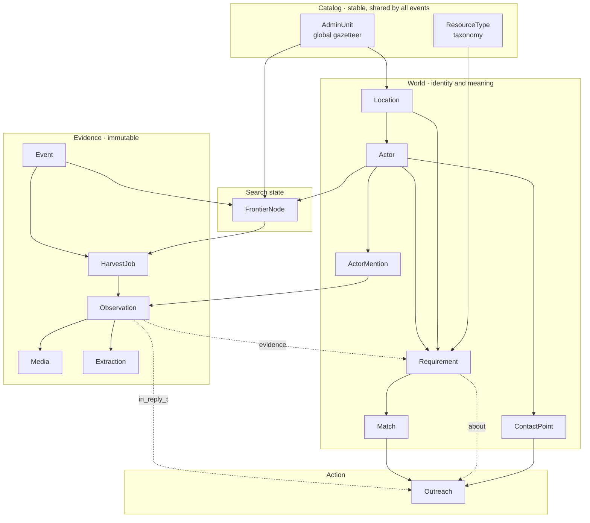

# Data model

How the pieces fit together. Field-level detail lives in the code — this explains what each
model is *for* and why the boundaries fall where they do.

App: `ayudagente.radar` (label `radar`). Models are split by layer under
`ayudagente/radar/models/` and re-exported from the package.

---

## The one idea that shapes everything

Three things are kept apart that are tempting to merge:

**Evidence → Interpretation → State of the world.**

An `Observation` is what we scraped: a post, with its permalink and timestamp. It is
immutable. An `Extraction` is what the model understood from it. A `Requirement` is what we
believe is true in the world, supported by one or more observations.

This matters because of a concrete case. When someone posts *"we no longer need water at the
Coliseo"*, that does not delete the earlier requirement. It is **a new observation that
changes its status**. History is preserved and every closure can be explained. If extraction
were allowed to write over evidence, none of that would be auditable — and re-running a
better prompt would mean re-scraping everything.

## The second idea: quality decides, cost only gets recorded

An earlier draft scored every search target by cost-benefit and allocated a budget across
rings. That was wrong, and the arithmetic behind it was wrong too. Sweeping is cheap: you do
not run one query per municipality, you batch toponyms into one query per platform × zone ×
axis. The pilot covered a whole country in ten queries for $0.10.

So there is no budget to optimize. `Event.spent_usd` and `HarvestJob.actual_cost_usd` exist
because Apify returns the number for free and a runaway loop should be visible, but **nothing
in the system decides based on them**. What decides is `FrontierNode.yield_rate`: whether a
target produces actionable content. Keep looking where the content is good, stop where it is
noise.

The one allocation decision that survives is **depth**, not breadth — see `HarvestJob`.

---

## Layers

---

## Catalog

**`AdminUnit`** is an administrative division of *any* country, loaded from GeoNames. It does
something a geocoder cannot: it **enumerates**. Google resolves a string you already have into
coordinates; this answers "which searchable places exist in this country", which is what the
frontier iterates over. Walking real entities is also what stops the agent inventing place
names.

The hierarchy is `country → admin_1 → admin_2 → admin_3`, the GeoNames convention, so the same
catalog works in Colombia, Indonesia or Turkey. `centroid` lets us rank places by distance to
the epicenter without geocoding anything.

**`ResourceType`** is the taxonomy of what people need and offer. A table rather than an enum
so resources can be added mid-emergency without a migration, and hierarchical so a need for
*sleeping mats* can be satisfied by an offer of *bedding* when nothing closer exists.

Neither belongs to an event. Everything else does.

---

## Event: the isolation boundary

**`Event`** is one concrete disaster. Actors, requirements and frontier nodes belong to
exactly one and never mix across events.

`country_code` and `languages` are what let one pipeline run anywhere. Three things read them:
which toponyms anchor a query, which payment rails to look for in the text, and which
languages to search and classify in.

`lexicon` carries how people name the event — hashtags, nicknames — and, under `negatives`,
the terms of *other* concurrent emergencies. Those get injected into every query. During the
pilot, searches without them pulled in earthquakes from Venezuela, Peru, Indonesia and
Granada; this is the cheapest defense against conflating two disasters, and it lives as data
rather than code so it can be tuned mid-event.

---

## Evidence

**`HarvestJob`** is a harvesting decision turned into an executable record — the *only*
artifact the frontier agent produces. The agent decides and writes the job; a worker executes
it against Apify. That split is what lets a failed harvest be retried without invoking the
model again, and it is why rate limits never corrupt agent state.

`target_kind` is where the real allocation decision lives. A `search` over a place is cheap
because toponyms are batched. A `profile`, `thread` or `comments` pull is the **deep pass**,
and depth is the thing worth choosing.

`rationale` stores in plain text why the agent chose this target. Not needed to run; needed to
debug and to show the agent's judgment on the dashboard.

`actor_down` exists because an Apify Actor can return success with zero results while actually
being broken — we hit exactly this during the pilot. Mistaking that for "no signal here" makes
the frontier penalize a place that did have information.

**`Observation`** is a post or comment exactly as the platform returned it. The author snapshot
lives here rather than on `Actor` because profiles change and we want the state at posting
time. Which fields arrive varies by platform, so all of them are optional:

| | X | Instagram | Facebook | TikTok |
|---|---|---|---|---|
| Follower count | yes | **no** | **no** | yes |
| Avatar | yes | **no** | yes | yes |
| Native geo | 2% | 34% | **0%** | 19% |
| Has media | 53% | 100% | 44% | 100% |

Those gaps are measured on a Colombian event, not assumed — and they will differ elsewhere.
Two consequences hold regardless: credibility scoring must be computed per platform because
the available signal differs, and real location almost always has to be extracted from text.

**`Media`** holds imagery with **our own permanent copy**. Platform media URLs are signed and
expire within hours, so storing only the link leaves the frontend with broken images and the
model with nothing to re-evaluate. For videos we keep the frames the vision model actually
looked at, so audits are reproducible without the storage cost.

`platform_alt_text` is text the platform gives away — Facebook returns it on 100% of posts
carrying media and transcribes the text on the flyer, often removing the need to call vision
at all. `sha256` catches the same photo recycled across posts and across events, the cheapest
defense against image-based misinformation.

**`Extraction`** is what the model understood, one-to-one with the observation. Classification,
structured fields, image reading and the geocoding query string all come out of a *single*
schema-constrained multimodal call — one call rather than four because per-deployment token
quota is the real bottleneck, and because the model resolves contradictions better seeing text
and image together.

One extraction can produce **several** requirements — a post listing three collection centers
produces three. That relation lives on `Requirement.evidence`.

---

## World

**`Location`** is a resolved point that always records **how fine it is**. Precision is not
decoration: a need placed in a whole province and a truck heading to a street address are both
a dot on a map, and without knowing the difference the system proposes impossible deliveries.
Locations are deduplicated on normalized text plus admin unit, so a frequently-mentioned place
is geocoded once rather than a hundred times.

**`Actor`** is the node of the graph: any entity that needs or offers something. Unifying the
same actor across dozens of posts under different names is the hardest data problem in the
system — without stable identity there is no saturation counting and no outreach history.

Resolution runs as a cascade, and **embeddings are the weakest signal in it, not the first**:

1. Deterministic keys — same platform handle, same normalized phone, same email
2. Blocking by administrative unit, so only plausible candidates are compared
3. Trigram similarity (`pg_trgm`), which beats semantic similarity on proper nouns
4. Embeddings (`pgvector`), for the same place worded differently
5. LLM adjudication of what remains ambiguous

Step 4 exists because steps 1–3 miss *"Cruz Roja Risaralda"* vs *"Seccional Risaralda de la
Cruz Roja Colombiana"*. It is not the primary mechanism: `"Coliseo Mayor"` and `"Coliseo
Menor"` are nearly identical as vectors and are different places.

`is_organization` is **derived from `kind`**, not stored, so it cannot go stale and cannot be
skipped by `bulk_create`. Filter in SQL with `kind__in=ORGANIZATION_KINDS`.

`merged_into` keeps duplicates instead of deleting them so a bad merge can be undone.

**`ActorMention`** is the audit trail of that cascade: which post, which surface form, which
signal resolved it, and the model's reasoning. It makes a bad merge diagnosable rather than
mysterious.

**`ContactPoint`** is one concrete way to reach an actor. Its own table rather than a JSON blob
because it must be queried, because attempts are counted per channel, and because one channel
can be marked bounced without touching the others. Details also surface incrementally: the
phone in one post, the email three days later.

`value` is normalized and `raw_value` preserved — `"300 2377012"`, `"+57 300 237 7012"` and
`"3002377012"` are one phone, and without normalization the uniqueness constraint is
worthless. `times_seen` is a confidence signal.

Payment rails are **one kind with the network as data** (`payment_network`: nequi, pix, mpesa,
upi), because they are country-specific and there is no reason to migrate the schema when the
system reaches a new country. The system never moves money; it only surfaces the detail — which
is also why payment details are not outreach channels.

`preference_rank()` orders which channel a human is offered first. It grants no permission,
because nothing is ever sent automatically.

---

## Supply and demand

**`Requirement`** holds needs and offers in **one table** separated by `direction`. They share
every field but polarity, and a single post routinely produces both: *"we have plenty of food
but no way to move it"* is an offer of food and a need for transport from the same actor.
Unified, matching is one query. Split, it is two queries and a pile of special cases.

Transport justifies the shape: five trucks are one row with `resource=transport`,
`quantity=5`, `location` as origin and `destination` as drop-off.

`quantity` and `covered_quantity` are what make saturation work. When a center needs 20
volunteers and 10 are committed, the system stops proposing it. Without this it keeps pushing
people toward a saturated site — the failure that does the most harm in a real emergency.

`covered_quantity` is a **cache, not the truth**. The truth is the sum of committed quantities
across matches a human acted on, and `recompute_covered_quantity()` derives it from there.
Counting starts at `contacted` rather than `confirmed` on purpose: ten messages in flight
already saturate a site.

**`Match`** links a need to an offer, optionally **through** a transport requirement.
`via_transport` is what makes three-node chains work: food in one city satisfies a need in
another only when a transport requirement connects them. Longer chains are a theoretical
problem we do not have.

Matches are produced in batch. The matching pass loads open requirements into an in-memory
graph (NetworkX) and solves an allocation problem, because pairwise greedy matching leaves
needs uncovered that had a solution. Postgres stays the source of truth; the graph is rebuilt
and thrown away each pass. Connected-component analysis on that graph yields the most valuable
alert in the system: *needs with no reachable supply at all*.

**Recomputation only rewrites rows still in `proposed`.** Anything at `contacted` or beyond is
frozen, because by then a real person has been written to.

---

## Action

**`Outreach`** is one proposed message about one finding. **Nothing is ever sent by the
system.** Every channel resolves to the same pattern: a URL that drops a human in the right
place, plus the text the model wrote.

| Channel | URL | Text |
|---|---|---|
| WhatsApp | `wa.me/…?text=…` | carried by the URL |
| Email | `mailto:…?subject=…&body=…` | carried by the URL |
| Comment reply | the observation's permalink | copy button |
| Direct message | the profile URL | copy button |

That single pattern removes what used to be an exception. Automating direct messages and
comment replies is not merely hard, it is unavailable — Meta's API only replies on your own
posts, TikTok has no messaging API, and DM-automation Actors get accounts banned. Assisting
them costs nothing and works everywhere. Automatic email was dropped for the same reason in
reverse: it needs a domain, a mail service and deliverability work, and new-domain mail to
strangers lands in spam. `mailto:` is the same trick as `wa.me`.

`purpose` is what lets **any** observation become actionable, not only a match:

| Purpose | Example |
|---|---|
| `connect` | A truck is heading where a need is |
| `answer` | Someone asked where to go; the graph knows |
| `verify` | That collection point's post is a day old — is it still open? |
| `request_detail` | The post says "we need help" with no neighborhood or contact |

Three optional anchors say what a message is *about*: `match`, `in_reply_to` (a specific post
or comment) and `about_requirement`.

`idempotency_key` is unique and derived from recipient, purpose, channel and anchor. A task
can retry three times, but the proposal is created once — which is what keeps "ten people
already contacted" true rather than approximately true.

---

## Search state

**`FrontierNode`** is one watch target with its running quality record. It watches **either an
`admin_unit` or an `actor`, never both and never neither** — enforced by a check constraint.
Places are the broad sweep; accounts are what you follow once one turns out to be a real
coordinator. Both compete for the same attention, so they share one table.

**This is the only table the agent reads.** A few dozen rows, a couple of thousand tokens. It
never sees a single post. Reading a scoreboard and deciding where to look next is judgment,
which is what a model is good at; extracting a phone number from a caption is a function,
which it is not.

The decision signal is `yield_rate` — actionable items per hundred. There is no score dividing
by price, because there is no budget to allocate. A node that yields nothing across several
passes goes to `exhausted`.

Cadence is **not stored**. The scheduler derives it from `yield_rate` and `last_useful_find_at`
when it runs, so there is no field to keep in sync.

`is_unexplored` supports forced exploration. A fixed share of every pass must go to targets
with no history, or the agent converges onto what it already knows and never finds the rural
district nobody was posting about twenty minutes ago — precisely the highest-value case.

---

## Invariants worth defending in review

1. `Observation` is never updated or deleted. New information is a new row.
2. `Extraction` never writes into `Observation`.
3. A `Match` past `proposed` is never rewritten by the matching pass.
4. `Outreach` is only ever created through its idempotency key, and nothing is ever sent
   automatically.
5. Actor merges set `merged_into`; they never delete.
6. Every `Location` carries its precision, and matching enforces a minimum.
7. A `FrontierNode` watches exactly one of a place or an account.
8. Every scraping query carries a toponym from the event's country, or it pulls in other
   countries' disasters.
9. Cost is recorded, never used to decide.

---

## Infrastructure this model requires

- **PostGIS** for proximity queries and spatial indexes
- **pgvector** for actor embeddings
- **pg_trgm** for name similarity, **unaccent** for normalization

Migration `0003_postgres_extensions` creates all four and declares `run_before` on
`0001_initial`, because the `vector` column cannot exist before its extension does. That makes
the schema self-contained: the test database, CI and a fresh clone all get them without
depending on `docker/init-extensions.sql`, which only runs on the container's first boot.

The database container publishes **5433** to avoid colliding with a system Postgres on 5432.
